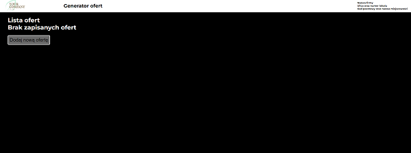

<div position="center">

</div>

# OfferGenerator

## Wstęp - opis i idea powstania

Cześć! Chciałbym przedstawić Ci bardzo prostą aplikację, która zrodziła się z faktycznej potrzeby.

Otóż w od kilku lat pracuję na stanowisku menadżera projektu w bardzo fajnej, składającej się z młodych osób i dynamicznie rozwijającej się firmie.  
Działamy w branży obróbki stali, a dokładnie rzecz nazywając produkujemy komponenty z blach stalowych, rur oraz profili. Jako menadżer niemal codziennie wysyłam oferty handlowe do naszych klientów, jak i firm zainteresowanych współpracą. Niestety, nasz system do zarządzania produkcją generuję na chwilę obecną mało estetyczne pliki arkuszy kalkulacyjnych, wyglądają wręcz archaicznie. Klient kupuję oczami, to prawdą z która każdy z Nas zmierzył się niejednokrotnie w życiu. Stąd chciałem, aby oferty które będę wysyłał do klientów były równie wysokiej jakości jak nasze wyroby. Jeżeli pracujesz w podobnej branży po delikatnej modyfikacji programu możesz również robić również to Ty! Opis gdzie trzeba dokonać zmian w kodzie umieszczę na końcu ✌

## Demo

link do filmu

## Technologia

<div display="flex" flex-direction="row" align-items="center">
  
    </div>


## Dodatkowe paczki + wersja
 - express 4.17.1,
 - express-handlebars 6.0.1, 
 - method-override 3.0.0,
 - nodemon 2.0.16,
 - uuid 8.3.2,


##  Opis działania

Aplikacja jest bardzo prosta, bo generuję dość prosty dokument.
Po uruchomieniu wyświetla się główne okno aplikacji, w którym wyświetlają się utworzone oferty, które możemy następnie:
- przeglądać, poprzez nacisnięcie odnośnika 'Szczegóły' i dalej drukować, jeżeli uznamy, że mamy już wprowadzone wszystko co oferta powinna zawierać.
- modyfikować, możemy dodawać i usuwać produkty.
- usuwać oferty z listy.
- dodawać kolejne.

## Najważniejsze wymagania jakie musiała spełniać aplikacja

#### Tworzenie ofert
- każda oferta musi posidać unikalny numer, składający się na chwilę obecną z conajmniej 7 cyfr.
- ważność oferty od daty utworzenia to 30 dni kalendarzowych, jeżeli w tym czasie klient złoży zamówienie pozycja trafia do cennika, gdzie cena jest ważna dopóki nie nastąpi jej rekalkulacja np. w wyniku znacznego skoku cen stali.
- pola adresu klienta muszą być wypełnione

#### Edycja ofert
- każdy produkt dodany do oferty musi posiadać:
> -opis,
> -ilość (MOQ - en. Minimum Order Quantity, czyli minmalna ilość zakupu, można podać kilka progów dla konkretnego produktu tworząc w ofercie progi cenowe np. dla 1/5/10 sztuk.)
> -cenę,
- nie musi posiadać komentarza, pole to jest dla menadżera, gdzie może on dodać krótka notatkę.

#### Szablon oferty
- logo firmowe w lewym górnym rogu, prawy górny róg adres firmy,
- poniżej ma znajdować się numer oferty, z prawej data utrzworzenia z datą ważności i terminem realizacji zamówienia,
- linia niżej to kolejno od lewej adres firmy i adres klienta,
- lista ofert,
- dodatkowe informacje dla klienta.


#### Instalacja 

```bash
$ npm install
```


#### Uruchamianie


```bash

$ npm start

```

#### Modfikacja danych 
##### Logo 
Otwórz plik <strong>views/layouts/main.hbs</strong>

Poniższy element <anchor> zawiera nazwę ścieżki w której znajduję się logo, podmień plik na swój w dowolnym formacie graficznym zachowując rozdzielczośćś ok. 260 x 70 px 
```bash
<a href="/"></a>

```
#### Nazwa firmy

W wyżej wymienionym pliku zmodyfikuj poniższe elementy wpisując dane w odpowienie pola
```bash
<div class="company-address">
    <h3>Nazwa firmy</h3>
    <h3>Ulica oraz numer lokalu</h3>
    <h3>Kod pocztowy oraz nazwa miejscowości</h3>
</div>

```

Zmian należy dokonać również w pliku <strong>views/offer/print-preview.hbs</strong> w:
- kod zaczynający się od linii 24.
```bash
<div class="company-address">
    <h3>Nazwa firmy</h3>
    <h3>Ulica oraz numer lokalu</h3>
    <h3>Kod pocztowy oraz nazwa miejscowości</h3>
</div>
```
- oraz w warunkach oferty zacznających się od linii 64.
  Gdzie należy w podać w dwóch miejscach nazwę firmy. 
  Modyfikować można cały blok, dostosowując warunki oferty pod swoją firmę  


```bash
<div class="description">
     <div class="top-section">
          <p><strong>The prices contained in offer are net prices.</strong></p>
          <p>Shipping conditions: <span>DDP 6% included</span></p>
          <p>Form of payment: <span>bank transfer</span></p>
          <p>The prices are special, calculated for the purposes of this offer.</p>
          <p>Goods are shipped on pallets feedback.</p>
          <p>We reserve the rights to increase the price specified in the offer if the price of materials will increase significantly.</p>
     </div>
     <div class="middle-section">
          <p><strong>Your Company Name</strong> does not hold responsibility for incorrect execution of an order/project it the results from
                     an inconsistency between the provided 2D documentation (pdf format) and the 3D model (e.g. stp format).
          </p>
          <p>The execution of the order is based on provided documentation and does not entitle <strong>Your Company Name</strong> to modify it.</p>
          <p>Creating new documentation or modifying the current one may only take place upon the client is request in the form of a paid order.</p>
     </div>
     <div class="bottom-section">
          <p>Documentation and its revision are verified during technological works. Any revision update may be reported up to 3 working days 
             from placing the order. After this term, the production process of the order begins and the necessity of modifying the design is
             subject to additional analysis by the technology department. If the changes are accepted, the cost are quoted.
          </p>
     </div>
</div>
'''